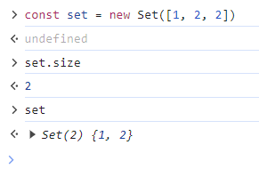

# [level 0] 주사위 게임 2 - 181930

[문제 링크](https://school.programmers.co.kr/learn/courses/30/lessons/181930)

### 성능 요약

- [나의 풀이] 메모리: 33.7 MB, 시간: 0.05 ms
- [`Set` 이용한 풀이] 메모리: 33.5 MB, 시간: 0.04 ms

### 코드 리뷰

#### 나의 풀이

```js
function solution(a, b, c) {
  const sum = a + b + c;
  const powTwo = Math.pow(a, 2) + Math.pow(b, 2) + Math.pow(c, 2);
  const powThree = Math.pow(a, 3) + Math.pow(b, 3) + Math.pow(c, 3);

  if (a === b && b === c) return sum * powTwo * powThree;
  else if (a !== b && b !== c && c !== a) return sum;
  else return sum * powTwo;
}
```

- `sum`, `powTwo`, `powThree` 변수 선언을 통해 연산을 처리한다.
- `pow` 메서드를 이용하였다.
- `a === b && b === c`, `a !== b && b !== c && c !== a` 로 조건을 직접 작성하였다.

#### `Set`을 이용한 다른 풀이

```js
function solution(a, b, c) {
  const equal = new Set([a, b, c]).size;

  if (equal === 3) return a + b + c;
  else if (equal === 2) return (a + b + c) * (a ** 2 + b ** 2 + c ** 2);
  else
    return (
      (a + b + c) * (a ** 2 + b ** 2 + c ** 2) * (a ** 3 + b ** 3 + c ** 3)
    );
}
```

- 변수를 선언하지 않아 조건에 해당되는 연산만 처리할 수 있다.
- 메서드가 아닌 `**` 연산을 통해 간단하게 처리할 수 있다.
- `Set` 자료구조와 `size` 접근자 속성을 이용하여 조건을 간결하게 처리할 수 있다. <br> `Set`의 경우 중복되는 값을 추가하지 않기 때문에 Set 객체의 원소 수를 반환해주는 `size` 접근자 속성을 이용하면 다음과 같은 결과값을 반환한다.
  

#### 결론

- 변수 선언과 메서드는 남용하지 않는다.
- ES6에 `Set` 자료구조가 도입된 만큼 배열과 차이점을 이해하고 해결할 수 있는 부분에서는 사용해보자!
- 참고자료: [Set.prototype.size](https://developer.mozilla.org/ko/docs/Web/JavaScript/Reference/Global_Objects/Set/size), [자바스크립트 세트(Set) 완벽 가이드](https://www.daleseo.com/js-set/)

<br/>

### 구분

코딩테스트 연습 > 코딩 기초 트레이닝

### 채점결과

정확성: 100.0<br/>합계: 100.0 / 100.0

### 제출 일자

2024년 1월 2일 11:56:46

### 문제 설명

<p>1부터 6까지 숫자가 적힌 주사위가 세 개 있습니다. 세 주사위를 굴렸을 때 나온 숫자를 각각 <code>a</code>, <code>b</code>, <code>c</code>라고 했을 때 얻는 점수는 다음과 같습니다.</p>

<ul>
<li>세 숫자가 모두 다르다면 <code>a</code> + <code>b</code> + <code>c</code> 점을 얻습니다.</li>
<li>세 숫자 중 어느 두 숫자는 같고 나머지 다른 숫자는 다르다면 (<code>a</code> + <code>b</code> + <code>c</code>) × (<code>a</code><sup>2</sup> + <code>b</code><sup>2</sup> + <code>c</code><sup>2</sup> )점을 얻습니다.</li>
<li>세 숫자가 모두 같다면 (<code>a</code> + <code>b</code> + <code>c</code>) × (<code>a</code><sup>2</sup> + <code>b</code><sup>2</sup> + <code>c</code><sup>2</sup> ) × (<code>a</code><sup>3</sup> + <code>b</code><sup>3</sup> + <code>c</code><sup>3</sup> )점을 얻습니다.</li>
</ul>

<p>세 정수 <code>a</code>, <code>b</code>, <code>c</code>가 매개변수로 주어질 때, 얻는 점수를 return 하는 solution 함수를 작성해 주세요.</p>

<hr>

<h5>제한사항</h5>

<ul>
<li><code>a</code>, <code>b</code>, <code>c</code>는 1이상 6이하의 정수입니다.</li>
</ul>

<hr>

<h5>입출력 예</h5>
<table class="table">
        <thead><tr>
<th>a</th>
<th>b</th>
<th>c</th>
<th>result</th>
</tr>
</thead>
        <tbody><tr>
<td>2</td>
<td>6</td>
<td>1</td>
<td>9</td>
</tr>
<tr>
<td>5</td>
<td>3</td>
<td>3</td>
<td>473</td>
</tr>
<tr>
<td>4</td>
<td>4</td>
<td>4</td>
<td>110592</td>
</tr>
</tbody>
      </table>
<hr>

<h5>입출력 예 설명</h5>

<p>입출력 예 #1</p>

<ul>
<li>예제 1번에서 세 주사위 숫자가 모두 다르므로 2 + 6 + 1 = 9점을 얻습니다. 따라서 9를 return 합니다.</li>
</ul>

<p>입출력 예 #2</p>

<ul>
<li>예제 2번에서 두 주사위 숫자만 같으므로 (5 + 3 + 3) × (5<sup>2</sup> + 3<sup>2</sup> + 3<sup>2</sup> ) = 11 × 43 = 473점을 얻습니다. 따라서 473을 return 합니다.</li>
</ul>

<p>입출력 예 #3</p>

<ul>
<li>예제 3번에서 세 주사위 숫자가 모두 같으므로 (4 + 4 + 4) × (4<sup>2</sup> + 4<sup>2</sup> + 4<sup>2</sup> ) × (4<sup>3</sup> + 4<sup>3</sup> + 4<sup>3</sup> ) = 12 × 48 × 192 = 110,592점을 얻습니다. 따라서 110592를 return 합니다.</li>
</ul>

> 출처: 프로그래머스 코딩 테스트 연습, https://school.programmers.co.kr/learn/challenges
